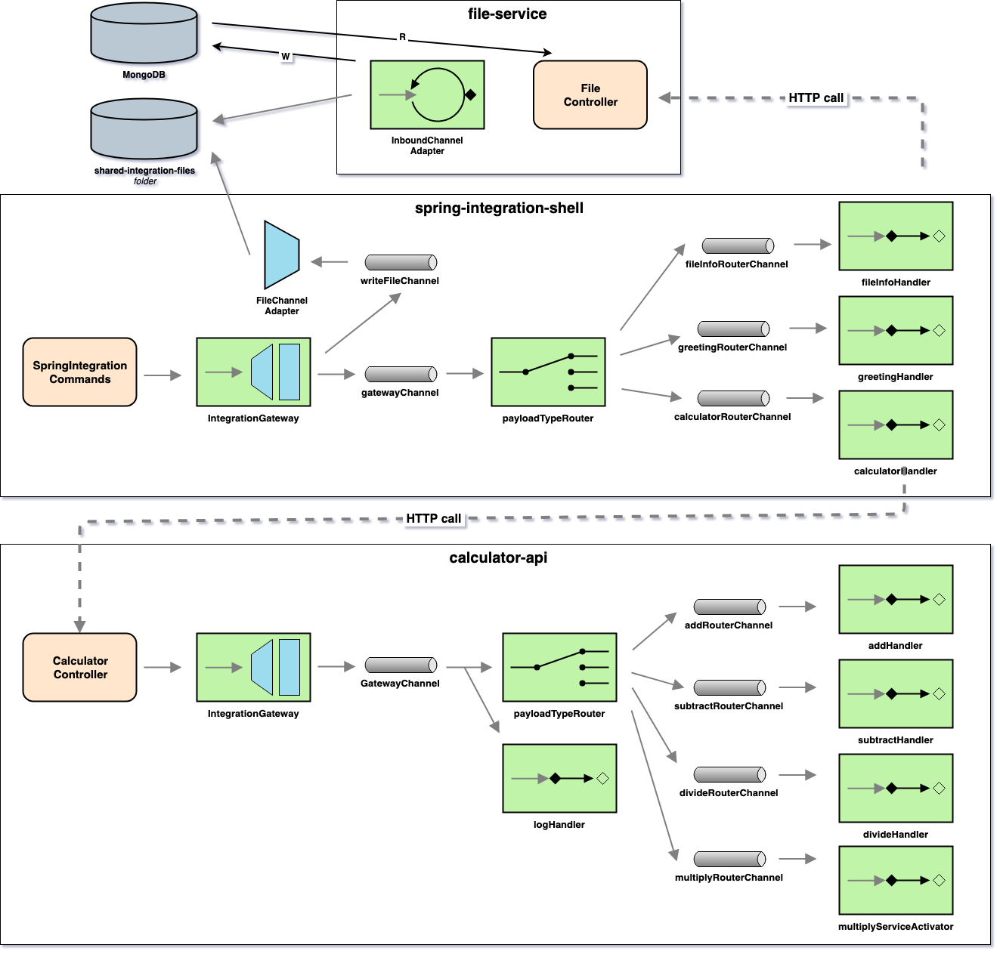
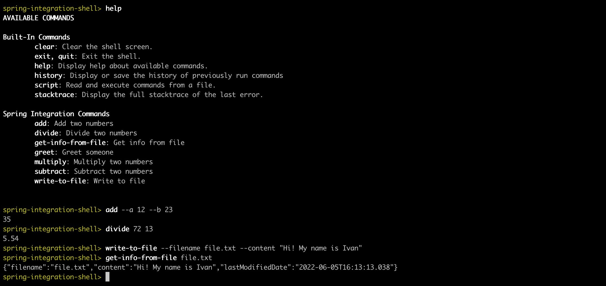

# spring-integration-examples

The goal of this project is to learn [`String Integration Framework`](https://docs.spring.io/spring-integration/reference/html/index.html). For it, we will implement some [`Spring Boot`](https://docs.spring.io/spring-boot/docs/current/reference/htmlsingle/) applications and try to use the well-known [`Enterprise Integration Patterns`](https://www.enterpriseintegrationpatterns.com/patterns/messaging/toc.html). 

## Proof-of-Concepts & Articles

On [ivangfr.github.io](https://ivangfr.github.io), I have compiled my Proof-of-Concepts (PoCs) and articles. You can easily search for the technology you are interested in by using the filter. Who knows, perhaps I have already implemented a PoC or written an article about what you are looking for.

## Project Architecture



## Applications

- ### calculator-api

  `Spring Boot` Java Web application that exposes an endpoint so that users can submit the operation (addition, subtraction, division or multiplication) they want to perform over two decimal numbers `a` and `b`.
  
  ```
  POST /api/calculate -d { "a": number, "b": number, "operation": ["ADD" | "SUBTRACT" | "DIVIDE" | "MULTIPLY"] }
  ```
  
- ### file-service

  `Spring Boot` Java Web application that exposes an endpoint so that users can get information about a file. This service keeps looking at `shared/files` folder for created or modified files and save their content and info in [`MongoDB`](https://www.mongodb.com/).
  
  ```
  GET api/files/{filename}
  ```

- ### spring-integration-shell

  `Spring Boot Shell` Java application that has a couple of commands. One is to write some content to a file. Those files are stored in `shared/files` folder. Besides, there are some commands that uses `calculator-api` to compute the basic Math operations. There is also has a command that calls `file-service` in order to get information about a file. All the communication with `calculator-api` and `file-service` is over `HTTP`. Finally, there is a simple command called `greet`, so that you can display a greeting message on the screen depending on the time of the day.

## Prerequisites

- [`Java 17+`](https://www.oracle.com/java/technologies/downloads/#java17)
- [`Docker`](https://www.docker.com/)

## Start Environment

- Open a terminal and navigate to `spring-integration-examples` root folder

- Run the following command
  ```
  docker compose up -d
  ```

## Running Applications with Maven

- **calculator-api**

  In a terminal and inside `spring-integration-examples` root folder run
  ```
  ./mvnw clean spring-boot:run --projects calculator-api
  ```

- **file-service**

  Open a new terminal and inside `spring-integration-examples` root folder run
  ```
  ./mvnw clean spring-boot:run --projects file-service
  ```

- **spring-integration-shell**

  Open a new terminal and inside `spring-integration-examples` root folder run
  ```
  ./mvnw clean spring-boot:run --projects spring-integration-shell
  ```

## Run applications as Docker containers

- ### Build Docker Images

  - In a terminal, make sure you are in `spring-integration-examples` root folder
  - Run the following script to build the Docker images
    - JVM
      ```
      ./docker-build.sh
      ```
    - Native (it's not implemented yet)
      ```
      ./docker-build.sh native
      ```

- ### Environment Variables

  - **calculator-api**

    `None`

  - **file-service**

    | Environment Variable | Description                                                         |
    |----------------------|---------------------------------------------------------------------|
    | `MONGODB_HOST`       | Specify host of the `MongoDB` database to use (default `localhost`) |
    | `MONGODB_PORT`       | Specify port of the `MongoDB` database to use (default `27017`)     |

  - **spring-integration-shell**

    | Environment Variable  | Description                                                       |
    |-----------------------|-------------------------------------------------------------------|
    | `CALCULATOR_API_HOST` | Specify host of the `calculator-api` to use (default `localhost`) |
    | `CALCULATOR_API_PORT` | Specify port of the `calculator-api` to use (default `9080`)      |
    | `FILE_SERVICE_HOST`   | Specify host of the `file-service` to use (default `localhost`)   |
    | `FILE_SERVICE_PORT`   | Specify port of the `file-service` to use (default `9081`)        |

- ### Start Docker Containers

  - In a terminal, make sure you are inside `spring-integration-examples` root folder
  - Run following command
    ```
    ./start-services.sh && ./start-shell.sh
    ```

## Playing around

- **calculator-api**

  A sample of request to add two numbers
  ```
  curl -i -X POST http://localhost:9080/api/calculate \
    -H 'Content-Type: application/json' \
    -d '{"operation": "ADD", "a": 10, "b": 12}'
  ```

- **spring-integration-shell**

  The `spring-integration-shell` UI and a sample of execution

  

- **file-service**

  A sample of request to get information about a file
  ```
  curl -i http://localhost:9081/api/files/file.txt
  ```

## Useful Commands

- **MongoDB**

  Find all files
  ```
  docker exec -it mongodb mongo filesdb
  db.myFiles.find()
  ```
  > Type `exit` to get out of `MongoDB shell`

## Shutdown

- To stop `spring-integration-shell`, go to the terminal where it is running and type `exit`
- To stop `calculator-api` and `file-service`
  - If you start them with `Maven`, go to the terminals were they are running and press `Ctrl+C`
  - If you start them as Docker containers, go to a terminal and, inside `spring-integration-examples` root folder, run the following script
    ```
    ./stop-services.sh
    ```
- To stop and remove `MongoDB` and docker compose network, go to a terminal and, inside `spring-integration-examples` root folder, run the command below
  ```
  docker compose down -v
  ```

## Cleanup

To remove the Docker images created by this project, go to a terminal and, inside `spring-integration-examples` root folder, run the following script
```
./remove-docker-images.sh
```

## References

- https://docs.spring.io/spring-integration/reference/html/index.html
- https://github.com/spring-projects/spring-integration/blob/master/src/reference/asciidoc/file.adoc