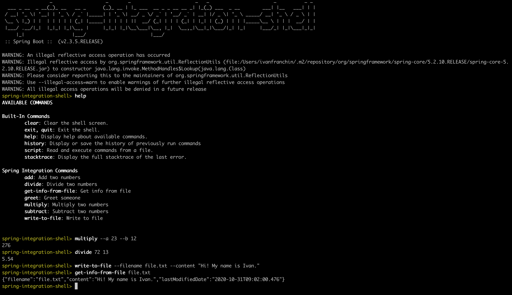

# `spring-integration-examples`

The goal of this project is to learn [`String Integration Framework`](https://docs.spring.io/spring-integration/reference/html/index.html)
For it, we will implement some [`Spring Boot`](https://spring.io/projects/spring-boot) applications and try to use the
well known [`Enterprise Integration Patterns`](https://www.enterpriseintegrationpatterns.com/patterns/messaging/toc.html). 

## Project Architecture


## Microservices

### calculator-api

Spring Boot Java Web application that exposes one endpoint `api/calculate` so that users can submit which operation
(addition, subtraction, division or multiplication) they want to perform over two decimal numbers `a` and `b`.

### file-service

Spring Boot Java Web application that exposes one endpoint `api/files/{filename}` so that users can get information
about a file. This service keeps looking at `shared-integration-files` folder for new created or modified files and
save their content and info in [`MongoDB`](https://www.mongodb.com/).

### spring-integration-shell

Spring Boot Shell Java application that has a couple of commands. One is to write some content to a file. Those files are
stored in `shared-integration-files` folder. Besides, there are some commands that uses `calculator-api` to compute the
basic Math operations. There is also has a command that calls `file-service` in order to get information about a file.
All the communication with `calculator-api` and `file-service` is over `HTTP`. Finally, there is a simple command called
`greet`, so that you can display a greeting message on the screen depending on the time of the day.

## Running Microservices

### calculator-api

Open a terminal and inside `spring-integration-examples` run
```
./mvnw clean spring-boot:run --projects calculator-api -Dspring-boot.run.jvmArguments="-Dserver.port=9080"
```

Sample of calls to `calculator-api`
```
curl -i -X POST http://localhost:9080/api/calculate \
  -H 'Content-Type: application/json' \
  -d '{"operation": "ADD", "a": 10, "b": 12}'
```

### file-service

Open a terminal and inside `spring-integration-examples` run
```
./mvnw clean spring-boot:run --projects file-service -Dspring-boot.run.jvmArguments="-Dserver.port=9081"
```

Sample of calls to `file-service`
```
curl -i http://localhost:9081/api/files/file.txt
```

### spring-integration-shell

Open a terminal and inside `spring-integration-examples` run
```
./mvnw clean spring-boot:run --projects spring-integration-shell
```

Sample of the shell interface and execution



## References

- https://docs.spring.io/spring-integration/reference/html/index.html
- https://github.com/spring-projects/spring-integration/blob/master/src/reference/asciidoc/file.adoc